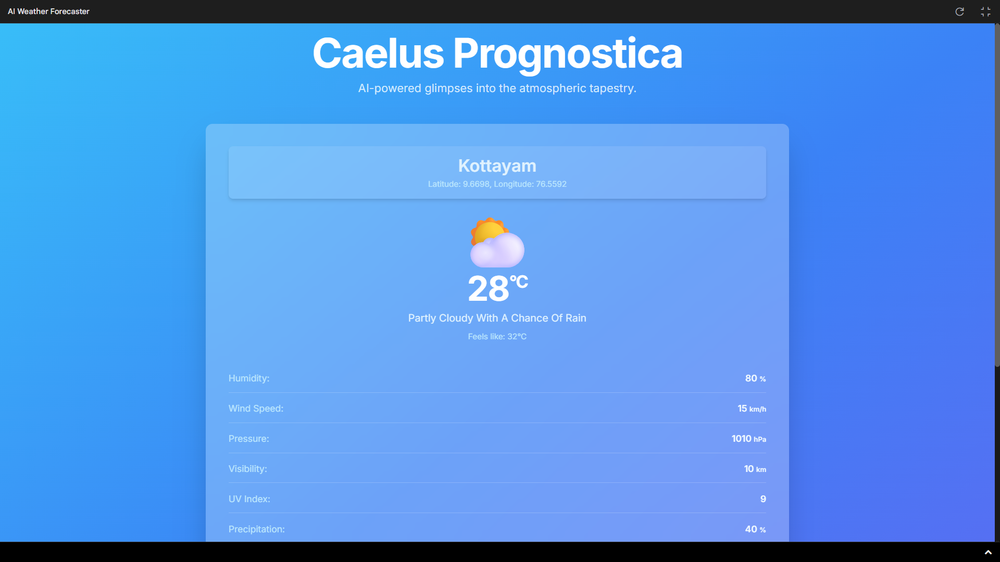

# Caelus Prognostica - AI Weather Forecaster


> If you find this project helpful, please consider ⭐ [starring the repository](https://github.com/dragonpilee/caelus-prognostica)!

---

Caelus Prognostica is an intelligent weather prediction application that leverages AI (via Google's Gemini API) to provide real-time, detailed weather forecasts based on your current geographical location. It features a dynamic, animated interface that changes based on the weather conditions and time of day.

---



---

## Features

- **Real-time Geolocation:** Automatically detects your current location to provide relevant forecasts.
- **AI-Powered Predictions:** Uses Google's Gemini API for generating weather data.
- **Detailed Weather Information:**
    - Temperature (current and "feels like")
    - Humidity
    - Wind Speed
    - Atmospheric Pressure
    - Visibility
    - UV Index
    - Chance of Precipitation
    - Sunrise and Sunset Times
    - Air Quality Index (AQI) value and qualitative description
    - General weather description (e.g., "Sunny", "Cloudy", "Light Rain")
- **Dynamic UI:**
    - Animated backgrounds that change based on current weather and time of day (day/night).
    - Animated weather icons.
    - Responsive design for various screen sizes, including widescreen PC displays.
- **User-Friendly Interface:**
    - Displays city name based on coordinates.
    - Loading states and clear error messages.
    - Manual "Refresh Weather" option.
    - Last updated timestamp for the forecast.
- **Accessibility:** ARIA attributes used for better screen reader support.
- **Offline Capability:** While weather fetching requires an internet connection, the UI is built to handle offline scenarios gracefully (though new data won't be available).

---

## Tech Stack

- **Frontend:** React 19, TypeScript, Tailwind CSS
- **AI Integration:** `@google/genai` (Gemini API)
- **Geolocation:** Browser Geolocation API
- **Styling:** Tailwind CSS, custom CSS for animations
- **Module Management:** ES Modules (ESM) via `importmap`

---

## Setup and Installation

1. **Clone the Repository (if applicable):**
    ```bash
    git clone <repository-url>
    cd <repository-directory>
    ```

2. **API Key Configuration:**
    - Obtain an API key from [Google AI Studio](https://aistudio.google.com/app/apikey).
    - Set this API key as an environment variable named `API_KEY`.  
      For local development, you might use a `.env` file (if your dev server supports it) or set it directly in your terminal:
      ```bash
      export API_KEY="YOUR_GEMINI_API_KEY"
      ```
    - The application code in `services/geminiService.ts` uses `process.env.API_KEY`.  
      **Do not hardcode your API key directly into the source code.**

3. **Install Dependencies (if using a local development server like Vite or Parcel):**
    ```bash
    npm install
    # or
    yarn install
    ```
    *Note: If running via CDN/importmap in `index.html`, local `npm install` may not be necessary, but is good practice for development.*

---

## How to Run

1. **Ensure API Key is Set:** Make sure the `API_KEY` environment variable is correctly configured.
2. **Serve `index.html`:**
    - Open the `index.html` file directly in a modern web browser, or
    - Serve the files through a local web server (recommended for ES module resolution):
        ```bash
        python -m http.server
        ```
        Then open `http://localhost:8000` in your browser.
    - Or use VS Code Live Server, or a dev tool like Vite/Parcel:
        ```bash
        npm run dev
        # or
        yarn dev
        ```

3. **Grant Location Permissions:** When the app loads, your browser will ask for permission to access your location. You must allow this for the app to function correctly.

---

## Project Structure

```
.
├── README.md               # This file
├── Screenshot.png          # Main screenshot
├── index.html              # Main HTML entry point
├── index.tsx               # Main React application entry (renders App.tsx)
├── App.tsx                 # Main application component (UI, logic, state)
├── types.ts                # TypeScript type definitions
├── metadata.json           # Application metadata and permissions
├── components/             # UI Components
│   ├── ErrorDisplay.tsx
│   ├── LoadingSpinner.tsx
│   ├── LocationDisplay.tsx
│   ├── WeatherDisplay.tsx
│   └── WeatherIcon.tsx
└── services/               # Business logic and API interactions
    ├── geolocationService.ts # Handles browser geolocation
    └── geminiService.ts      # Handles interaction with Gemini API
```

---

## Notes

- The weather data is AI-generated and should be considered an estimate.
- Ensure your browser supports the Geolocation API and ES Modules.
- The application is designed to be responsive and work across different devices.

---

Developed by Alan Cyril Sunny.  
Inspired by the need for beautiful and informative weather applications.

---
